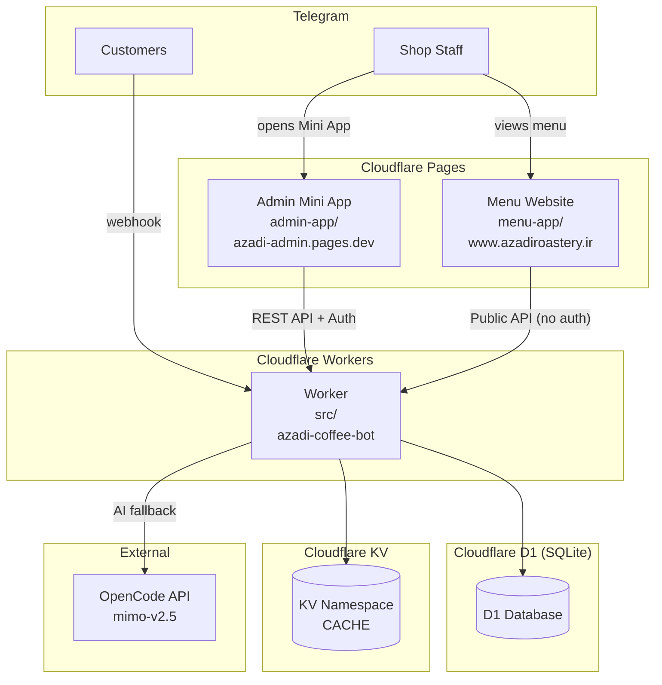

# Azadi Coffee Roastery — Internal Documentation

Azadi Coffee Roastery is a coffee shop in Iranshahr, Iran. This repository powers three interconnected systems: a Telegram bot for customers, an admin web app for shop staff, and a public menu website.

All bot UI text is in **Persian (Farsi)**. The admin and menu apps also display Persian content with RTL layout.

## Architecture



## Three Deployable Units

| Unit               | Directory    | Hosting            | URL                                                       |
| ------------------ | ------------ | ------------------ | --------------------------------------------------------- |
| **Worker**         | `src/`       | Cloudflare Workers | `azadi-coffee-bot.zahedrastgar316.workers.dev`            |
| **Admin Mini App** | `admin-app/` | Cloudflare Pages   | `azadi-admin.pages.dev`                                   |
| **Menu Website**   | `menu-app/`  | Cloudflare Pages   | `www.azadiroastery.ir` (fallback: `azadi-menu.pages.dev`) |

The Worker does **not** serve the admin or menu apps — they are separate Cloudflare Pages deployments.

## Tech Stack

- **Backend**: Cloudflare Workers, grammY (Telegram bot framework), Drizzle ORM, D1 (SQLite), KV
- **Admin App**: React 18, Vite 6, `@tma.js/sdk` (Telegram Mini App SDK), TanStack Query
- **Menu App**: React 18, Vite 6, TanStack Query, HashRouter → BrowserRouter, `@fontsource/vazirmatn`
- **CI/CD**: GitHub Actions (3 parallel jobs), Wrangler
- **AI**: OpenCode API (`mimo-v2.5` model) for chat fallback

## Documentation

| Document                           | Description                                                                          |
| ---------------------------------- | ------------------------------------------------------------------------------------ |
| [architecture.md](architecture.md) | Request flow, middleware chain, session management, deployable unit relationships    |
| [database.md](database.md)         | All 11 schema tables, migration workflow, repository pattern, DataService caching    |
| [api.md](api.md)                   | Admin REST API and Public API — endpoints, auth, request/response shapes             |
| [bot.md](bot.md)                   | Telegram bot commands, menus, product display, AI fallback, Persian text conventions |
| [admin-app.md](admin-app.md)       | Admin Mini App — auth, pages, role gating, UX conventions                            |
| [menu-app.md](menu-app.md)         | Menu website — routes, API consumption, caching, RTL layout                          |
| [deployment.md](deployment.md)     | CI/CD pipeline, Cloudflare bindings, secrets, local dev setup                        |
| [conventions.md](conventions.md)   | Coding patterns — Persian text, error handling, testing, lint/format rules           |
| [pitfalls.md](pitfalls.md)         | Known pitfalls — deployment, data, bot, admin app, testing                           |

## Quick Start

```bash
# Install dependencies
npm ci
cd admin-app && npm install && cd ..
cd menu-app && npm install && cd ..

# Run tests
npm test

# Typecheck everything
npm run typecheck
cd admin-app && npm run typecheck && cd ..
cd menu-app && npm run typecheck && cd ..

# Full check (typecheck + lint + format + test)
npm run check
```

See [deployment.md](deployment.md) for local dev setup and environment variables.
