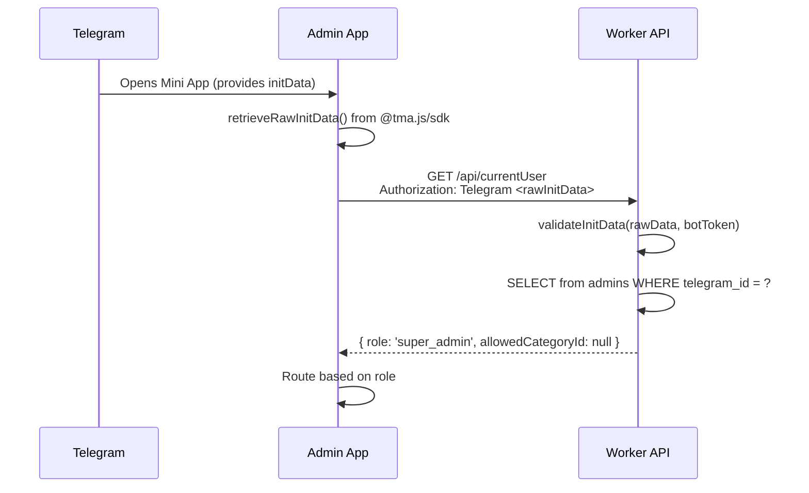

# Admin Mini App

The admin Telegram Mini App is a React-based web application loaded inside Telegram's webview. It provides shop staff with inventory management, settings, insights, and a chat interface. See also: [api.md](api.md) for the REST API it consumes, [deployment.md](deployment.md) for deployment details.

## Auth Flow



**Critical**: The app uses `retrieveRawInitData()` from `@tma.js/sdk` (not `retrieveLaunchParams().initDataRaw`, which was removed in v3). The raw string is sent as `Authorization: Telegram <raw>`.

The Worker validates the HMAC signature against `TELEGRAM_BOT_TOKEN` and checks the `auth_date` field (24-hour window, not Telegram's default 5 minutes — see [pitfalls.md](pitfalls.md)).

## API Communication

All communication with the backend is via the Admin REST API. The Mini App **never** calls the bot directly.

```ts
// admin-app/src/api/client.ts
const PROD_API_BASE = 'https://azadi-coffee-bot.zahedrastgar316.workers.dev/api';

// In local dev, VITE_API_BASE must be set (throws if missing)
```

The `apiFetch<T>(path, { method, body, signal })` wrapper:

- Sends `Content-Type: application/json`
- Includes `Authorization: Telegram <rawInitData>` header
- Throws on non-ok responses
- Generic type parameter `T` for response typing

## Pages and Routes

The app uses `HashRouter` (hash-based URLs inside Telegram's webview).

### Role-Based Access

| Role             | Accessible Pages                                | Default Route |
| ---------------- | ----------------------------------------------- | ------------- |
| `super_admin`    | Inventory, Insights, Settings                   | `/inventory`  |
| `category_admin` | Counter, Inventory (restricted to own category) | `/counter`    |

### Route Table

| Route                       | Page Component        | Access      | Description                      |
| --------------------------- | --------------------- | ----------- | -------------------------------- |
| `/counter`                  | `CounterPage`         | All admins  | Sales counter / quick actions    |
| `/inventory`                | `InventoryPage`       | All admins  | Product and category management  |
| `/inventory?tab=products`   | `ProductsSubTab`      | All admins  | Product list with inline editing |
| `/inventory?tab=categories` | `CategoriesSubTab`    | All admins  | Category management              |
| `/insights`                 | `InsightsPage`        | super_admin | Analytics and AI logs            |
| `/settings`                 | `SettingsPage`        | super_admin | Shop configuration               |
| `/chat`                     | `ChatPanel` (overlay) | All admins  | AI chat interface                |

### Legacy Redirects

Several old routes redirect to their new locations:

- `/products` → `/inventory?tab=products`
- `/categories` → `/inventory?tab=categories`
- `/configure`, `/info`, `/branches`, `/faqs`, `/admins`, `/menu-config`, `/messages` → `/settings`
- `/ai-logs`, `/ai-test` → `/insights`

### Bottom Navigation

A fixed bottom nav bar shows:

- **Super admins**: Inventory, Insights, Settings (3 tabs) + Chat button
- **Category admins**: Counter, Inventory (2 tabs) + Chat button

The nav uses `overflow-x: auto` with `flex-shrink: 0` to ensure all tabs are reachable via scrolling. Do not change this to `justify-content: space-around` (see [pitfalls.md](pitfalls.md)).

## Key Pages

### Inventory Page

The main management page with tabs for products and categories:

- **Products tab** (`ProductsSubTab`): Lists all products with inline stock editing (`InlineStockEditor`), product form drawer for create/edit
- **Categories tab** (`CategoriesSubTab`): Category CRUD, sort order management

### Settings Page

Configuration panel for super admins:

- Shop info (about text, price unit, Instagram)
- Menu visibility toggles (`menu_visible_*` settings)
- Branch management
- FAQ management
- Admin user management
- Menu config (category-to-section mapping)
- Messages / customer feedback

### Insights Page

Analytics dashboard for super admins:

- AI conversation logs (`AILogsPage`)
- AI test interface (`AITestPage`)

### Chat Panel

A sliding chat panel (lazy-loaded `ChatPanel`) that opens/closes via state. Uses the `useAIChat` hook for message sending/receiving.

## UX Conventions

| Convention               | Implementation                                                  |
| ------------------------ | --------------------------------------------------------------- |
| **Toast notifications**  | `showToast()` — never `alert()`                                 |
| **Form fields**          | Wrapped in `<Field label>` — placeholder is a hint, not a label |
| **Empty states**         | Every list renders an `.empty-state` block when empty           |
| **RTL for Persian data** | `dir="auto"` on Persian text elements; app chrome stays English |
| **Telegram haptics**     | `useTelegramHaptics` hook for tactile feedback                  |
| **Theme integration**    | `useTelegramTheme` hook reads theme params from Telegram SDK    |

## Components

| Component             | Purpose                                      |
| --------------------- | -------------------------------------------- |
| `BranchSelector`      | Dropdown for switching between branches      |
| `ConfirmDialog`       | Confirmation modal for destructive actions   |
| `DoubleBezelCard`     | Card with double-border styling              |
| `EmptyState`          | Shown when lists have no data                |
| `ErrorBoundary`       | Catches rendering errors                     |
| `Field`               | Form field wrapper with label                |
| `Icon` / `IconSprite` | SVG icon system                              |
| `InlineStockEditor`   | Quick stock adjustment without opening form  |
| `InventoryList`       | Generic list for inventory items             |
| `ProductFormDrawer`   | Slide-out form for creating/editing products |
| `SegmentedControl`    | Tab-like segmented control                   |
| `SkeletonLoader`      | Loading placeholder                          |
| `Spinner`             | Loading indicator                            |
| `StatTile`            | Metric display card                          |
| `Toast`               | Notification toast                           |

## Dependencies

| Package                 | Purpose                                      |
| ----------------------- | -------------------------------------------- |
| `@tma.js/sdk`           | Telegram Mini App SDK (auth, theme, haptics) |
| `@tanstack/react-query` | Server state management (default config)     |
| `react-router`          | Hash-based routing                           |
| `react` / `react-dom`   | UI framework                                 |

All apps use `@tma.js/sdk` (not the deprecated `@telegram-apps/sdk`). See [pitfalls.md](pitfalls.md) for migration details.
