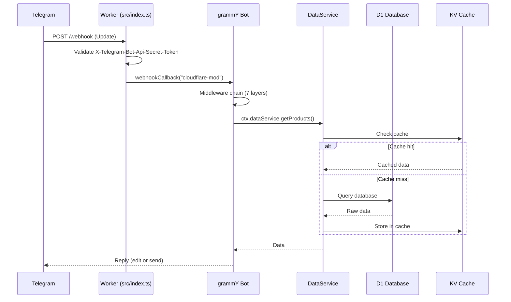
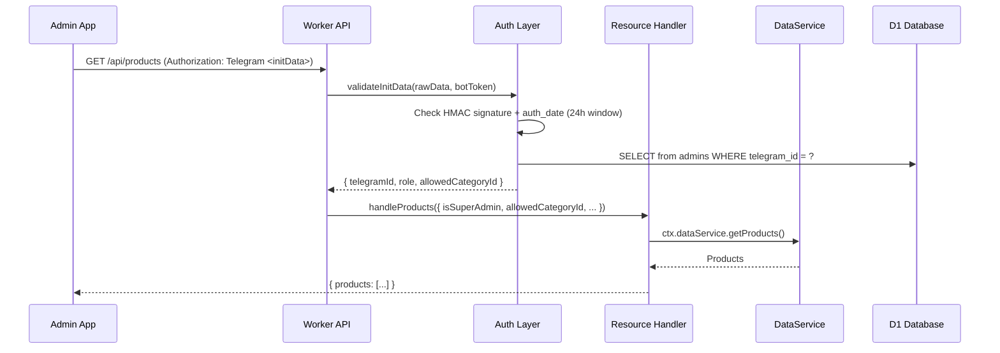
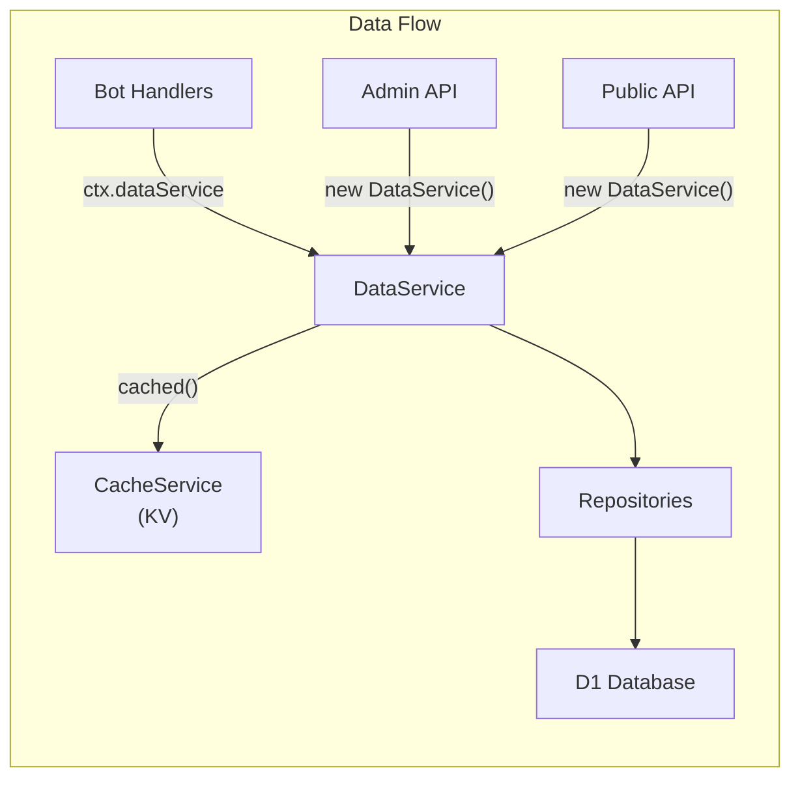

# Architecture

Deep architectural walkthrough of the Azadi Coffee Roastery system. See also: [database.md](database.md) for schema details, [api.md](api.md) for endpoint reference, [bot.md](bot.md) for bot behavior.

## Request Flow

### Telegram Webhook

When a user sends a message to the bot, Telegram sends a POST to `/webhook`:



### Worker Entry Point (`src/index.ts`)

The Worker's `fetch` handler routes incoming requests:

| Path                     | Handler                    | Auth                                                       |
| ------------------------ | -------------------------- | ---------------------------------------------------------- |
| `GET/POST /webhook`      | grammY `webhookCallback`   | `X-Telegram-Bot-Api-Secret-Token` (timing-safe comparison) |
| `GET/POST /api/*`        | `handleApiRequest()`       | `Authorization: Telegram <initData>` header                |
| `GET/POST /api/public/*` | `handlePublicApiRequest()` | None                                                       |
| Anything else            | 404                        | N/A                                                        |

All paths log structured JSON with timestamps, method, path, status, and duration.

### Admin API Request Flow



## Middleware Chain

The bot's middleware stack (in `src/bot.ts`) processes every update in this order:

1. **Environment injection** — Sets `ctx.env`, `ctx.execCtx`, and creates a `DataService` (with optional `CacheService`) per request.
2. **Session** — `D1SessionStorage`-backed session. Initial state: `{}`.
3. **Idempotency guard** — Compares `ctx.update.update_id` against `ctx.session.lastUpdateId`. Drops duplicate updates (Telegram retry protection).
4. **Conversations** (conditional) — Only registered when `env.USE_CONVERSATIONS === 'true'`. Currently dormant. Uses D1-backed storage with `convo_` prefix. See [pitfalls.md](pitfalls.md) for why this is gated.
5. **Menu registration** — `mainMenu` registers sub-menus: `discoverMenu`, `infoMenu`, `drinksNavMenu`, `beansMenu`, `cakesMenu`.
6. **`/start` command** — Sets bot commands via Telegram API, sets chat menu button, exits conversations, sends welcome text with mainMenu keyboard.
7. **Admin commands** — Registers `/admin`, `/menu`, `/setup_bot`.
8. **Callback handlers** — Handles inline keyboard callbacks.
9. **Message handlers** — Free-text messages (AI fallback).

## Request Context Pattern

`src/requestContext.ts` uses module-level globals to make `env` and `ExecutionContext` available to code that can't receive them through grammY context (e.g., repository constructors):

```ts
// Per-request, called in index.ts before any routing
setRequestContext(env, ctx);

// Later, in repository constructors or middleware
const env = getRequestContext().env;
```

This works because Cloudflare Workers isolate each request. **It breaks in tests** — mock `env` directly instead.

## Session Management

- **Storage**: `D1SessionStorage` (src/database/sessionStorage.ts) — a grammY `StorageAdapter` that reads/writes the `sessions` table as key/value JSON.
- **Session data** (`SessionData` in src/types/context.ts):
  - `lastUpdateId` — for idempotency
  - `messageFlow` — multi-step message composition state (name → content → rating → confirm)
  - `menuStack` — tracks navigation history for menu back-button behavior
- **Conditional storage**: `ConditionalSessionStorage` wraps `D1SessionStorage` and can disable session persistence when configured.

## Conversations Middleware

grammY's `conversations()` framework is registered **only** when `env.USE_CONVERSATIONS === 'true'`. It's currently off because:

1. Conversations store state per-request
2. Telegram retries send the same update again
3. On retry, the conversation state is gone (new request), so the update falls through to the AI fallback
4. This caused wizard final messages to be answered by the AI instead of the wizard

Re-introduction requires (see [pitfalls.md](pitfalls.md)):

- Persistent D1 storage with `prefix: "convo_"` (avoids session key collisions)
- A `ctx.hasActiveConversation` snapshot middleware registered **before** `createConversation()` enter
- A skip guard in `src/handlers/message.ts` before the AI fallback

## Deployable Units

### Worker (`src/`)

The core backend. Handles three concerns:

1. **Telegram webhook** — Receives updates, runs through grammY middleware, sends replies
2. **Admin REST API** (`/api/*`) — CRUD for all shop data, role-based access
3. **Public API** (`/api/public/*`) — Read-only menu data for the menu website

Deployed via `wrangler deploy`. Uses D1 for storage, KV for caching. The Worker does **not** serve any HTML/JS assets.

### Admin Mini App (`admin-app/`)

A Telegram Mini App loaded inside Telegram's webview. Communicates with the Worker **exclusively** via the Admin REST API — it never calls the bot directly.

Deployed to Cloudflare Pages at `azadi-admin.pages.dev`. See [admin-app.md](admin-app.md) for details.

### Menu Website (`menu-app/`)

A public-facing menu site with no auth. Consumes the Public API. Deployed to Cloudflare Pages at `www.azadiroastery.ir`. See [menu-app.md](menu-app.md) for details.



The `DataService` is the single data access layer for all bot handlers and the admin API. The public API creates its own `DataService` instances. Repositories are never instantiated directly in handlers.
