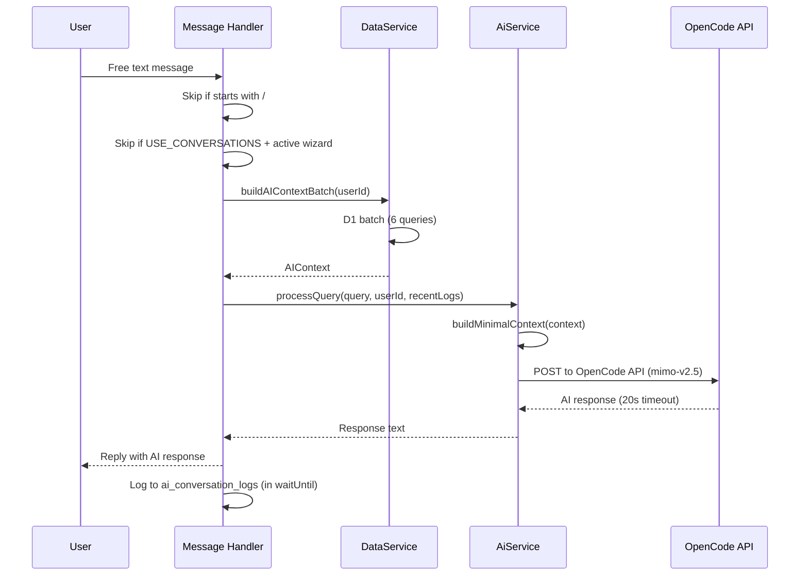

# Telegram Bot

Complete reference for the Azadi Coffee Roastery Telegram bot. See also: [architecture.md](architecture.md) for middleware chain, [api.md](api.md) for REST API, [database.md](database.md) for schema.

## Commands

| Command | Auth | Description |
|---------|------|-------------|
| `/start` | None | Sends welcome text with main menu keyboard. Sets bot commands via Telegram API, sets chat menu button, exits any active conversations, manages menu message lifecycle. |
| `/admin` | Admin required | Opens the admin Mini App via an `InlineKeyboardButton` with `web_app` pointing to `https://azadi-admin.pages.dev`. |
| `/menu` | None | Opens the menu website via an `InlineKeyboardButton` with `web_app` pointing to `https://azadi-menu.pages.dev`. |
| `/setup_bot` | Admin required | Re-registers bot commands and menu button via Telegram API. Used by the bot owner to push command updates. |

**Registered commands**: Only `/start` and `/admin` (plus `/setup_bot` for the bot owner) are registered via `setMyCommands`. Do not add more without updating `src/commands/admin.ts`.

## Menu System

The bot uses grammY's `menu` plugin for persistent keyboard navigation. Menus are nested and registered in `src/bot.ts`.

### Menu Hierarchy

```
mainMenu
├── discoverMenu (Discover)
│   ├── ⭐ Featured (featured)
│   ├── 🌿 Seasonal (seasonal)
│   ├── 📋 Menu (passport — all categories)
│   ├── Products
│   │   ├── Coffee Beans (beansMenu)
│   │   └── Cakes & Pastries (cakesMenu)
│   └── Drinks (drinksNavMenu — dynamic from menu_config)
├── infoMenu (Info)
│   ├── About Us (aboutMenu)
│   ├── Branches (branchesMenu)
│   ├── FAQ (faqMenu)
│   └── Contact (contactMenu)
```

### Menu Navigation Pattern

- Lists use `editMessageText(...).catch(() => ctx.reply(...))` — edit the existing message in place, with a fresh reply as fallback if editing fails
- Detail views carry a `back:main` inline keyboard button handled in `src/handlers/callbackQuery.ts`
- The `menuStack` in session data tracks navigation history for back-button behavior

### Menu Visibility

Each menu section can be toggled via `menu_visible_*` keys in the `settings` table:
- `menu_visible_featured`, `menu_visible_seasonal`, `menu_visible_passport`
- `menu_visible_search`, `menu_visible_favorites`, `menu_visible_about`
- `menu_visible_drinks`, `menu_visible_beans`, `menu_visible_cakes`
- `menu_visible_branches`, `menu_visible_faq`
- Missing key = visible (safe default)
- Bot reads per-request via `isMenuVisible()` from `src/utils/menuVisibility.ts`
- Admin toggles via the "Menu Visibility" card on the Settings page in the admin app

### Menu Lifecycle

`src/utils/menuLifecycle.ts` manages the lifecycle of menu messages:
- Push new messages to a stack
- Evict old messages when the stack grows too large
- The stack is stored in `SessionData.menuStack`

## Product Display

### `formatProduct()` (`src/utils/formatters.ts`)

Formats a product for display in the bot. Shows:
- Product name and description
- Price (formatted with `formatPersianPrice`)
- Stock (hidden when `unit === 'cup'` — drinks are made-to-order)
- Nutritional info when present: calories, caffeine (mg), allergens
- Product flags: ⭐ Featured, 🌿 Seasonal

### Image Handling

- Products with `image_url` use `replyWithPhoto(url)` to display the image
- Products without images fall back to `reply()` for text-only display
- Admins paste image URLs from free hosts (imgbb, imgur, etc.) via the admin app
- **R2 is not used** — requires credit card activation

### Coffee Bean Details

For products with `coffee_details`, the bot shows:
- Origin, farm, altitude, processing method
- Roast level, flavor notes
- `brew_guide` — detailed brewing instructions
- Acidity and body profiles

## AI Fallback System

When a user sends a free-text message that doesn't match a command or menu callback, the AI fallback handles it.

### Flow



### Context Building

`ctx.dataService.buildAIContextBatch(userId)` collapses 6 D1 queries into a single batch:
1. Products with coffee_details (joined)
2. Active branches
3. FAQs
4. Visible menu config with category names
5. `about` setting
6. Recent AI logs for the user

`buildMinimalContext()` (in `src/utils/menuContext.ts`) enriches this into the AI context with:
- Shop identity (about text)
- Enriched product details (farm, altitude, processing, brew guide, nutritional info)
- Product flags (⭐ Featured, 🌿 Seasonal)

### AI Configuration

- **Model**: `mimo-v2.5` via OpenCode API
- **Timeout**: 20 seconds via `Promise.race`
- **Logging**: After replying, logs to `ai_conversation_logs` in `ctx.execCtx.waitUntil` (non-blocking)
- **API key**: `OPENCODE_API_KEY` environment variable (Cloudflare secret)

### Performance Logging

When `PERF_LOG === 'true'` env var is set, per-request timing JSON is emitted to stdout. This is a per-request flag, not build-time.

## Persian Text Conventions

All bot UI text uses **HTML parse mode** (not Markdown).

### Number Formatting

```ts
import { toPersianDigits, formatPersianPrice } from '../utils/numbers';

toPersianDigits(12345);  // "۱۲۳۴۵"
toPersianDigits("abc");  // "abc" (non-digits unchanged)
```

### Price Display

```ts
formatPersianPrice(45000, "تومان");
// "۴۵,۰۰۰ ‏تومان"
// Wrapped in LRI/PDI isolates (U+2066/U+2069) for proper RTL rendering
```

**Rules**:
- Prices and stock: Persian digits
- Phone numbers and opening hours: Latin digits (for dial-ability)
- Page numbers: Persian digits

### LRI/PDI Isolates

`formatPersianPrice` wraps the price in **LRI** (Left-to-Right Isolate, U+2066) and **PDI** (Pop Directional Isolate, U+2069). This ensures the price renders LTR inside an RTL sentence. **Never remove these isolates** — without them, the price text renders RTL, which looks broken to users.

### HTML Parse Mode

Bot text uses HTML tags for formatting:
- `<b>bold</b>`
- `<i>italic</i>`
- `<code>code</code>`
- `<a href="url">link</a>`

Use `htmlEscape()` from `src/utils/htmlEscape.ts` on user-provided text before embedding in HTML messages.

## Handlers

### Callback Query Handler (`src/handlers/callbackQuery.ts`)

Handles all inline keyboard button presses:

**Navigation**:
- `back:main` — Pops current message from stack, deletes it from Telegram, sends fresh main menu

**Paginated lists** (5 items per page, `◀️` / `▶️` nav buttons):
- `faq:page:N`, `branches:page:N`, `beans:page:N`, `cakes:page:N`
- `drinks:cat:CAT_ID:page:N`, `featured:page:N`, `seasonal:page:N`, `passport:page:N`

**Detail views**:
- `branch:ID` — Single branch with map link
- `product:ID` — Product details with coffee_details when present, nutritional info, stock, VAT note

**Message flow callbacks**:
- `msg:confirm` — Saves the message + rating to `messages` table, notifies admins via Telegram
- `msg:cancel` — Cancels the message flow, removes `messageFlow` from session
- `rate:1` through `rate:5` — Sets rating on the message flow
- `rate:skip` — Skips rating

### Message Handler (`src/handlers/message.ts`)

Handles free-text messages through a priority chain:

1. **Message flow step machine**: If `ctx.session.messageFlow` exists, the message is routed through a multi-step flow (feedback/contact/anonymous). Each step handles the input and advances to the next. Users can type `/cancel` at any step to abort.
   - `name` → `content` → `rating` → `confirm` (send or cancel via inline buttons)
   - `/skip` on the name step sets `isAnonymous = true`
2. **Slash command skip**: Text starting with `/` is ignored (handled upstream)
3. **Conversations gate**: If `USE_CONVERSATIONS` is enabled and `ctx.hasActiveConversation` is true, skip (prevents AI from answering mid-wizard)
4. **AI fallback**: Falls through to the AI system

The handler also exports `runAiQuery()` — a standalone function used by the admin AI Test Panel endpoint (`POST /api/ai-test`) that bypasses bot-specific plumbing.

#### HTML Sanitization

AI responses pass through `sanitizeTelegramHtml()` before being sent, which strips any HTML tags not in the allowlist (`b`, `i`, `u`, `s`, `code`, `pre`, `a`, `tg-spoiler`). This prevents phishing links or malformed HTML from the AI model.

### Rate Limiting

A per-user cooldown (`checkAndSetCooldown` from `src/utils/rateLimit.ts`) throttles how fast users can send messages, preventing abuse of the AI fallback.

## Data Access

All bot data access goes through `ctx.dataService` — the `IDataService` instance injected per-request. **Never instantiate repositories directly in handlers or menus.** The DataService provides read-through KV caching via `CacheService`.

Key methods:
- `ctx.dataService.getProducts()` — cached product list
- `ctx.dataService.getCategories()` — cached categories
- `ctx.dataService.getBranches()` — cached branches
- `ctx.dataService.getSetting(key)` — individual setting (uncached to avoid stale reads)
- `ctx.dataService.buildAIContextBatch(userId)` — batched AI context

## Context Type

```ts
type MyContext = Context &
  SessionFlavor<SessionData> &
  ConversationFlavor<Context> & {
    env: Env;
    execCtx?: ExecutionContext;
    dataService: IDataService;
  };
```

Always use `MyContext` for handler types. The `dataService` field is the single data access layer.
