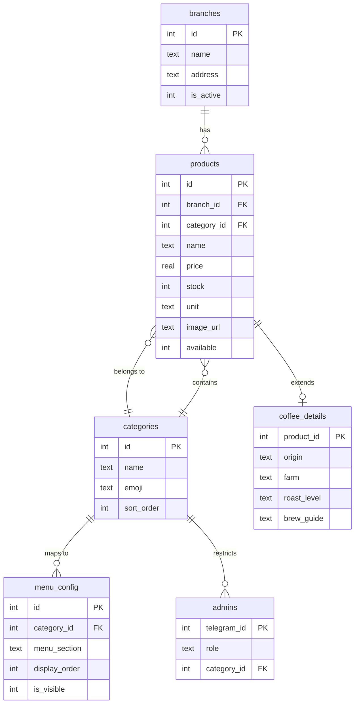

# Database

Complete data model reference for the Azadi Coffee Roastery D1 (SQLite) database. See also: [architecture.md](architecture.md) for how data flows through the system, [api.md](api.md) for how data is exposed via REST.

## Schema Tables

All tables are defined in `src/database/schema.ts` using Drizzle ORM. Column names use `snake_case` in the database. Drizzle maps them to `camelCase` in TypeScript.

### `branches`

Physical shop locations.

| Column | Type | Constraints | Description |
|--------|------|-------------|-------------|
| `id` | integer | PK, autoincrement | |
| `name` | text | NOT NULL | Branch name |
| `address` | text | NOT NULL | Full address |
| `phone` | text | nullable | Phone number (Latin digits for dial-ability) |
| `location` | text | nullable | Google Maps link or coordinates |
| `opening_hours` | text | nullable | Human-readable hours (Latin digits) |
| `is_active` | integer (boolean) | default `true` | Inactive branches hidden from public API |

### `categories`

Product groupings (e.g., "Drinks", "Coffee Beans", "Cakes").

| Column | Type | Constraints | Description |
|--------|------|-------------|-------------|
| `id` | integer | PK, autoincrement | |
| `name` | text | NOT NULL | Category name |
| `description` | text | nullable | |
| `emoji` | text | nullable | Display emoji (e.g., ☕) |
| `sort_order` | integer | default 0 | Display ordering |

### `products`

All sellable items — drinks, beans, cakes.

| Column | Type | Constraints | Description |
|--------|------|-------------|-------------|
| `id` | integer | PK, autoincrement | |
| `branch_id` | integer | FK → `branches.id`, nullable | Branch-specific product (null = all branches) |
| `category_id` | integer | FK → `categories.id`, NOT NULL | |
| `name` | text | NOT NULL | |
| `description` | text | nullable | |
| `price` | real | nullable | Price in the unit configured via `price_unit` setting |
| `stock` | integer | NOT NULL, default 0 | Hidden for `cup` unit products (drinks are made-to-order) |
| `unit` | text | NOT NULL, default `'item'` | One of: `item`, `kg`, `g`, `cup` |
| `image_url` | text | nullable | Full public URL (imgbb, imgur, etc.) — R2 not used |
| `available` | integer (boolean) | default `true` | |
| `featured` | integer (boolean) | default `false` | |
| `price_on_request` | integer (boolean) | default `false` | |
| `is_seasonal` | integer (boolean) | default `false` | |
| `size_options` | text | nullable | JSON or comma-separated size variants |
| `syrup_options` | text | nullable | Available syrup additions |
| `calories` | integer | nullable | Per-serving calories |
| `allergens` | text | nullable | Allergen information |
| `caffeine_mg` | integer | nullable | Caffeine content in mg |
| `created_at` | integer (timestamp) | NOT NULL | Unix timestamp |
| `updated_at` | integer (timestamp) | NOT NULL | Unix timestamp |

**Indexes**: `idx_products_category`, `idx_products_available`, `idx_products_featured`, `idx_products_seasonal`, `idx_products_cat_avail` (composite on `category_id` + `available`).

### `coffee_details`

Extended metadata for coffee bean products. One-to-one with `products`.

| Column | Type | Constraints | Description |
|--------|------|-------------|-------------|
| `product_id` | integer | PK, FK → `products.id` | |
| `origin` | text | nullable | Country/region of origin |
| `farm` | text | nullable | Farm or estate name |
| `altitude` | text | nullable | Growing altitude |
| `processing` | text | nullable | Washed, natural, honey, etc. |
| `variety` | text | nullable | Coffee variety (Bourbon, Geisha, etc.) |
| `roast_level` | text | nullable | Light, medium, dark |
| `flavor_notes` | text | nullable | Tasting notes |
| `recommended_brew` | text | nullable | Recommended brew method |
| `acidity` | text | nullable | Acidity profile |
| `body` | text | nullable | Body profile |
| `brew_guide` | text | nullable | Detailed brewing instructions |

### `faq`

Frequently asked questions.

| Column | Type | Constraints | Description |
|--------|------|-------------|-------------|
| `id` | integer | PK, autoincrement | |
| `question` | text | NOT NULL | |
| `answer` | text | NOT NULL | |

### `settings`

Key-value store for shop configuration. Bot reads per-request; admin app reads/writes.

| Column | Type | Constraints | Description |
|--------|------|-------------|-------------|
| `key` | text | PK | |
| `value` | text | NOT NULL | |

**Known keys**: `about`, `price_unit`, `instagram`, `welcome_message`, `vat_note`, `announcement`, `menu_visible_*` (visibility toggles for bot menu sections).

**Public API whitelist**: Only `about`, `price_unit`, `instagram`, `welcome_message`, `vat_note`, `announcement` are exposed via the public API. Other keys (including `menu_visible_*`) are admin-only.

### `ai_conversation_logs`

Records of AI chat interactions.

| Column | Type | Constraints | Description |
|--------|------|-------------|-------------|
| `id` | integer | PK, autoincrement | |
| `user_id` | text | NOT NULL | Telegram user ID |
| `question` | text | NOT NULL | User's message |
| `response` | text | NOT NULL | AI's reply |
| `timestamp` | integer (timestamp) | NOT NULL | |

**Index**: `idx_ai_logs_user_ts` (on `user_id` + `timestamp`).

### `sessions`

grammY session storage. Key/value JSON.

| Column | Type | Constraints | Description |
|--------|------|-------------|-------------|
| `key` | text | PK | Session key (chat ID) |
| `value` | text | NOT NULL | JSON-serialized `SessionData` |

### `admins`

Registered administrator accounts.

| Column | Type | Constraints | Description |
|--------|------|-------------|-------------|
| `telegram_id` | integer | PK | Telegram user ID |
| `role` | text | NOT NULL, default `'super_admin'` | `super_admin` or `category_admin` |
| `category_id` | integer | FK → `categories.id`, nullable | Required for `category_admin` — restricts access to one category |

### `menu_config`

Maps categories to bot menu sections and controls display order.

| Column | Type | Constraints | Description |
|--------|------|-------------|-------------|
| `id` | integer | PK, autoincrement | |
| `category_id` | integer | FK → `categories.id`, NOT NULL | |
| `menu_section` | text | NOT NULL | `drinks`, `beans`, `cakes`, or `extras` |
| `display_order` | integer | NOT NULL, default 0 | Ordering within the section |
| `is_visible` | integer (boolean) | NOT NULL, default `true` | |
| `button_label` | text | nullable | Custom label for the menu button |
| `special_message` | text | nullable | Shown when the category is selected |
| `created_at` | integer (timestamp) | NOT NULL | |
| `updated_at` | integer (timestamp) | NOT NULL | |

### `messages`

Customer messages / feedback submitted via the bot.

| Column | Type | Constraints | Description |
|--------|------|-------------|-------------|
| `id` | integer | PK, autoincrement | |
| `telegram_id` | text | NOT NULL | Sender's Telegram user ID |
| `sender_name` | text | nullable | |
| `sender_email` | text | nullable | |
| `content` | text | NOT NULL | Message body |
| `rating` | integer | nullable | 1–5 stars |
| `is_anonymous` | integer (boolean) | default `false` | |
| `is_read` | integer (boolean) | default `false` | |
| `replied` | integer (boolean) | default `false` | |
| `reply_text` | text | nullable | Admin's reply |
| `replied_at` | integer (timestamp) | nullable | |
| `created_at` | integer (timestamp) | NOT NULL | |

**Indexes**: `idx_messages_unread`, `idx_messages_created`, `idx_messages_user`.

## Relationships



## Migration Workflow

Migrations use Drizzle Kit to generate SQL, then Wrangler to apply to D1.

```bash
# 1. Generate migration SQL from schema changes
npx drizzle-kit generate

# 2. Review the generated SQL in drizzle/
#    Migration files: 0000_baseline.sql, 0001_add_check_constraints.sql

# 3. Apply to remote D1
wrangler d1 execute azadi-db --remote --file=drizzle/XXXX_name.sql
```

**Never use `drizzle-kit push`** — D1 doesn't have a connection URL. See [pitfalls.md](pitfalls.md) for details.

D1 migrations are additive only. Drizzle `generate` does not create `DROP TABLE` migrations — write manual SQL if you need to remove a table. See [pitfalls.md](pitfalls.md).

## Repository Pattern

Each table group has a repository class in `src/repositories/`. All take `d1Binding: D1Database` in the constructor.

| Repository | Tables | Purpose |
|-----------|--------|---------|
| `ProductRepository` | `products`, `coffee_details` | Product CRUD, joins with coffee_details |
| `CategoryRepository` | `categories` | Category CRUD |
| `BranchRepository` | `branches` | Branch CRUD |
| `FaqRepository` | `faq` | FAQ CRUD |
| `SettingsRepository` | `settings` | Key-value settings |
| `AiLogRepository` | `ai_conversation_logs` | AI conversation logging |
| `MenuConfigRepository` | `menu_config` | Menu section configuration |
| `MessageRepository` | `messages` | Customer message management |

Repository barrel export: `src/repositories/index.ts`.

## DataService

`DataService` (`src/services/data/index.ts`) implements `IDataService` (`src/services/types.ts`). It is the **single data access layer** — all bot handlers and menu interactions access data through `ctx.dataService`.

### Read-Through Caching

The `cached<T>(key, fetcher)` method implements read-through KV caching:
1. Check KV for the key
2. If found, return cached value
3. If not, call `fetcher()`, store result in KV, return it
4. Falls through to direct fetch if no `CacheService` is configured

**Cached paths**: Products list, categories, branches, FAQs, menu config, settings.

**Uncached paths** (by design):
- `getProductById` — unique key, low reuse
- `getByFlag` (featured/seasonal) — low-volume
- Individual `getSetting` — avoids stale reads
- AI logs — per-user, time-sensitive

### Cache Invalidation

Prefix-based deletion via `CacheService.deleteByPrefix()`:
- `invalidateProducts()` — clears all product-related cache entries
- `invalidateBranches()`, `invalidateFaqs()`, `invalidateMenuConfig()`, `invalidateSettings()` — each clears its own namespace

### Batch Operations

`buildAIContextBatch(userId)` collapses 6 D1 queries into a single batch call:
1. Products with coffee_details (joined)
2. Active branches
3. FAQs
4. Visible menu config with category names
5. `about` setting
6. Recent AI logs for the user

This minimizes D1 round-trips for AI context building.
