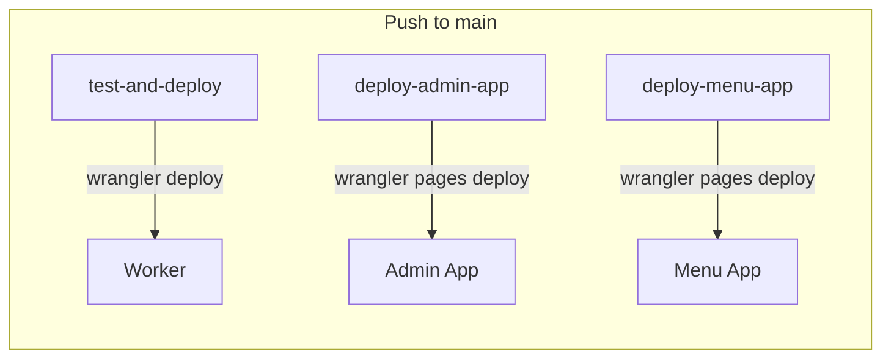

# Deployment

CI/CD pipeline, Cloudflare bindings, environment variables, and local development setup. See also: [architecture.md](architecture.md) for how the three deployable units relate.

## CI/CD Pipeline

Deployment happens exclusively through GitHub Actions (`.github/workflows/deploy.yml`). **Push to `main` is the only auto-deployment trigger.** Local `deploy.sh` is for pre-flight validation only.



### Three Parallel Jobs

| Job                | What it does                                                                              | Deploy command                                                    |
| ------------------ | ----------------------------------------------------------------------------------------- | ----------------------------------------------------------------- |
| `test-and-deploy`  | `npm ci` → `npm test` → `npm run lint` → `npm run format:check` → `tsc --noEmit` → deploy | `wrangler deploy`                                                 |
| `deploy-admin-app` | `npm ci` in `admin-app/` → typecheck → lint → format:check → build                        | `wrangler pages deploy admin-app/dist --project-name=azadi-admin` |
| `deploy-menu-app`  | `npm ci` in `menu-app/` → typecheck → lint → format:check → build                         | `wrangler pages deploy menu-app/dist --project-name=azadi-menu`   |

**Shared configuration**:

- Runner: `ubuntu-latest`
- Timeout: 15 minutes per job
- Node.js: 22
- Concurrency: cancels in-progress runs for PRs (separate groups per job)
- Wrangler action: `cloudflare/wrangler-action@v4.0.0` pinned to commit SHA
- Wrangler version: `3.90.0` (pinned to avoid v4 breaking changes)
- All GitHub Action refs pinned to commit SHAs (not tags)
- `NPM_CONFIG_LEGACY_PEER_DEPS: 'true'` on all jobs (required for `@cloudflare/workers-types` v5 + wrangler v3 peer dep conflict)

### What CI Checks

Every job runs these checks **before** deploying:

1. **TypeScript type checking** (`tsc --noEmit`)
2. **ESLint** (`npm run lint`)
3. **Prettier format check** (`npm run format:check`)

All three are hard gates — any failure blocks deployment. There is no `continue-on-error`.

## Cloudflare Bindings

Defined in `wrangler.toml` at the project root:

| Binding | Type         | Name       | ID                                     |
| ------- | ------------ | ---------- | -------------------------------------- |
| `DB`    | D1 Database  | `azadi-db` | `2c020279-a453-4105-984d-c09bdda89819` |
| `CACHE` | KV Namespace | —          | `cf01f801bdae488b9196782f2541d288`     |

**Worker name**: `azadi-coffee-bot`
**Entry point**: `src/index.ts`
**Compatibility date**: `2026-08-05`
**Compatibility flag**: `nodejs_compat`

### What `wrangler deploy` Validates

Wrangler validates **all bindings** in `wrangler.toml` during deploy — even if the code doesn't reference them. If a KV namespace, D1 database, or R2 bucket doesn't exist or has been deleted, deploy fails. See [pitfalls.md](pitfalls.md).

## Environment Variables and Secrets

### Worker Secrets (set via `wrangler secret put` or Cloudflare dashboard)

| Secret               | Purpose                                                                       |
| -------------------- | ----------------------------------------------------------------------------- |
| `TELEGRAM_BOT_TOKEN` | Bot token from BotFather — used for webhook validation and Telegram API calls |
| `SECRET_TOKEN`       | Secret token for `X-Telegram-Bot-Api-Secret-Token` header validation          |
| `OPENCODE_API_KEY`   | API key for OpenCode (mimo-v2.5 model) used in AI fallback                    |
| `PERF_LOG`           | Set to `'true'` to enable per-request timing JSON on stdout (off by default)  |

### Worker Environment Variables (in `wrangler.toml`)

| Variable            | Purpose                                                             |
| ------------------- | ------------------------------------------------------------------- |
| `USE_CONVERSATIONS` | Set to `'true'` to enable conversations middleware (off by default) |

### Frontend Environment Variables

| Variable        | Used by   | Purpose                                                    |
| --------------- | --------- | ---------------------------------------------------------- |
| `VITE_API_BASE` | Both apps | API base URL for local dev (throws if missing in dev mode) |

## Local Development

### Worker

```bash
# Install dependencies
npm ci

# Run tests
npm test

# Full check (typecheck + lint + format + test)
npm run check

# Start local dev server
npx wrangler dev

# Pre-flight validation (no deploy)
./deploy.sh --dry-run
```

The local dev server at `http://localhost:8787` handles all three routes:

- `/webhook` — Telegram bot
- `/api/*` — Admin API
- `/api/public/*` — Public API

**Note**: `requestContext.ts` module globals work in Workers but **not** in tests. Mock `env` directly in tests.

### Admin Mini App

```bash
cd admin-app
npm install    # Must be installed separately (own node_modules)

# Copy env file and set API base
cp .env.example .env
# Edit .env: VITE_API_BASE=http://localhost:8787/api

npm run dev    # Vite dev server
npm run check  # Typecheck + lint + format:check + test
```

The Vite dev server does **not** proxy API requests to the Worker — you must set `VITE_API_BASE` manually.

### Menu Website

```bash
cd menu-app
npm install    # Must be installed separately (own node_modules)

# Copy env file and set API base
cp .env.example .env
# Edit .env: VITE_API_BASE=http://localhost:8787/api/public

npm run dev    # Vite dev server
npm run check  # Typecheck + lint + format:check + test
```

## Deployment Pitfalls

### Pages Staleness

`wrangler deploy` only updates the Worker. If the Mini App or menu site looks stale, check the **Pages deployment**:

```bash
# Check live asset hash
curl -s https://azadi-admin.pages.dev | grep -o '/assets/index-[^"]*\.css'

# Compare against local build
ls admin-app/dist/assets/
```

CI takes ~1–3 minutes after push to update Pages. If the hash doesn't match, the Pages deployment hasn't completed yet or failed.

### Binding Mismatches

If `wrangler.toml` references a non-existent binding, deploy fails even if the code doesn't use it. Always run `wrangler deploy --dry-run` after changing bindings.

### Legacy Peer Deps

The `wrangler-action@v3` (and v4 with pinned Wrangler 3.x) installs Wrangler v3.x which wants `@cloudflare/workers-types@^4.x`, but this repo uses v5.x. The `NPM_CONFIG_LEGACY_PEER_DEPS: 'true'` env var in CI prevents this from blocking `npm ci`. Do not remove it.

### Menu-App Build Script

The menu-app build includes `rm -f dist/assets/*.woff` to strip WOFF fonts from the dist directory (the app uses `@fontsource` instead). Do not remove this step.

## Custom Domain

The menu website is deployed to `www.azadiroastery.ir` via Cloudflare Pages custom domain. The fallback Pages URL is `azadi-menu.pages.dev`. The admin app is at `azadi-admin.pages.dev` (no custom domain).
