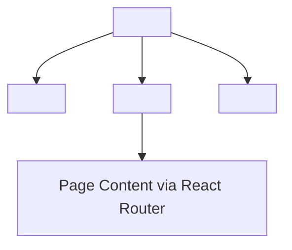

# Menu Website

The public menu website for Azadi Coffee Roastery. A read-only, no-auth React application that displays the shop's menu, branches, and FAQ. See also: [api.md](api.md) for the Public API it consumes, [deployment.md](deployment.md) for deployment details.

## Overview

- **URL**: [www.azadiroastery.ir](https://www.azadiroastery.ir) (fallback: `azadi-menu.pages.dev`)
- **No auth**: No Telegram SDK, no `Authorization` header
- **RTL layout**: `dir="rtl"` on `<html>`, all UI text in Persian
- **Deployed to**: Cloudflare Pages via CI (push to `main`)

## Routes

Uses `BrowserRouter` (clean URLs, not hash-based).

| Route           | Page Component  | Description                                               |
| --------------- | --------------- | --------------------------------------------------------- |
| `/`             | `HomePage`      | Home page with featured products and menu sections        |
| `/category/:id` | `CategoryPage`  | Products in a specific category                           |
| `/product/:id`  | `ProductPage`   | Single product detail (with coffee_details if applicable) |
| `/featured`     | `FeaturedPage`  | Featured products                                         |
| `/seasonal`     | `SeasonalPage`  | Seasonal products                                         |
| `/branches`     | `BranchesPage`  | Active shop locations                                     |
| `/faq`          | `FaqPage`       | Frequently asked questions                                |
| `*` (wildcard)  | Redirect to `/` |                                                           |

All pages are lazy-loaded via `React.lazy`.

## Layout



- **Header**: Site branding and navigation
- **Footer**: Site information
- **No bottom nav**: Unlike the admin app, the menu site uses header + footer only

## API Communication

```ts
// menu-app/src/api/client.ts
const PROD_API_BASE = 'https://azadi-coffee-bot.zahedrastgar316.workers.dev/api/public';

// No auth headers — this is the public-facing menu
```

### `apiFetch<T>(path, envelopeKey?)`

The core fetch function handles the Worker's envelope response format:

```ts
// Worker wraps all responses: { key: [...] }
// apiFetch unwraps when envelopeKey is provided:
const products = await apiFetch<Product[]>('/products', 'products');
// Returns the unwrapped array, not the wrapper object
```

**Envelope keys** (must match exactly):

- `/categories` → `categories`
- `/products` → `products`
- `/products/:id` → `product`
- `/products/featured` → `products`
- `/products/seasonal` → `products`
- `/branches` → `branches`
- `/faq` → `faqs`
- `/menu` → `sections`
- `/settings` → `settings`

**Pitfall**: Forgetting to pass the envelope key means the page receives the wrapper object (`{ products: [...] }`) instead of the array. `.map()` silently produces nothing (empty page) or crashes (white page). See [pitfalls.md](pitfalls.md).

### Environment Variable

In development, `VITE_API_BASE` must be set. The app throws a clear error if it's missing in dev mode. Production builds fall back to the hardcoded Worker URL.

```bash
# Local dev setup
cp .env.example .env
# Set VITE_API_BASE=http://localhost:8787/api/public
```

## Caching Strategy

Uses TanStack Query with these settings:

| Setting                | Value                 | Rationale                                            |
| ---------------------- | --------------------- | ---------------------------------------------------- |
| `staleTime`            | 5 minutes (300,000ms) | Menu data doesn't change frequently                  |
| `gcTime`               | 5 minutes (300,000ms) | Garbage collect unused cache after 5 min             |
| `refetchOnWindowFocus` | `false`               | Prevent unnecessary refetches when tab regains focus |
| `retry`                | `1`                   | One retry on failure (public API should be reliable) |

## Pages

### Home Page (`HomePage`)

The landing page showing:

- Shop information (from `about` setting)
- Menu sections (drinks, beans, cakes, extras)
- Quick links to featured and seasonal products

### Category Page (`CategoryPage`)

Displays all products in a given category. Route: `/category/:id` where `:id` is the category ID.

### Product Page (`ProductPage`)

Detailed product view. Route: `/product/:id`. Shows:

- Product name, description, price
- Image (if `image_url` is set)
- Nutritional info (calories, caffeine, allergens) when present
- Coffee details (origin, farm, altitude, processing, brew guide) for coffee bean products
- Size and syrup options

### Featured / Seasonal Pages

Filter products by `featured` or `isSeasonal` flags. Show only `available` products.

### Branches Page

Lists active branches (`isActive = true`) with name, address, phone, location, and opening hours.

### FAQ Page

Displays all FAQ entries (question/answer pairs).

## Components

| Component      | Purpose                                                                 |
| -------------- | ----------------------------------------------------------------------- |
| `EmptyState`   | Shown when no data is available                                         |
| `ErrorState`   | Shown on API errors                                                     |
| `Footer`       | Site footer                                                             |
| `Header`       | Site header with branding                                               |
| `ProductImage` | Product image with fallback                                             |
| `ProductRow`   | Product list item                                                       |
| `Spinner`      | Loading indicator                                                       |
| `Skeleton`     | Loading placeholder                                                     |
| `skeletons/*`  | Page-specific skeleton layouts (Home, Category, Product, Branches, FAQ) |

## Hooks

| Hook        | Purpose                           |
| ----------- | --------------------------------- |
| `useReveal` | Scroll-triggered reveal animation |

## Dependencies

| Package                 | Purpose                   |
| ----------------------- | ------------------------- |
| `@tanstack/react-query` | Server state with caching |
| `react-router`          | BrowserRouter routing     |
| `@fontsource/vazirmatn` | Persian font (Vazirmatn)  |
| `@fontsource/fraunces`  | English display font      |

**No Telegram SDK** — this is a public-facing site, not a Mini App.
